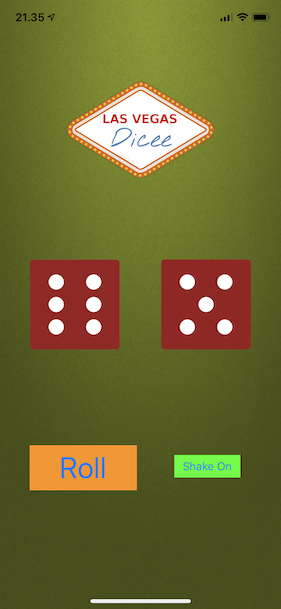
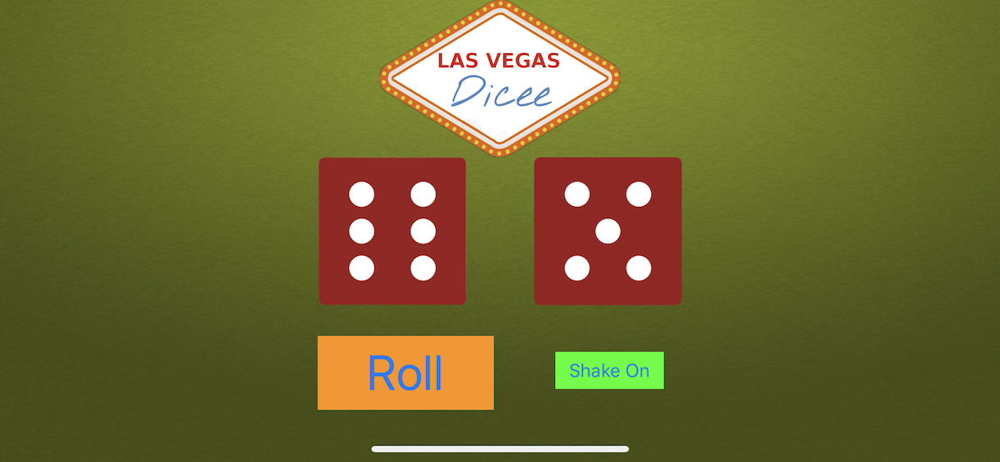
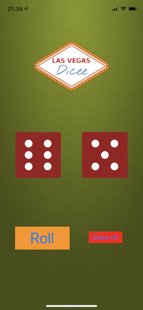
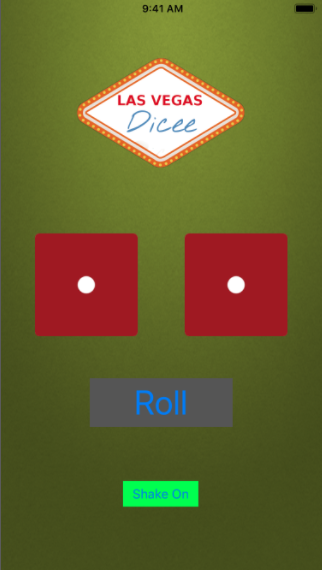

# Swift-Dice
Simple "Las Vegas" Dice game. 
You can either press "Roll" or shake the device (which can be turned off) to roll the 2 dices. 

Implemented features:

- Press "Roll"-button to roll the set of Dice
- Shake you device to roll the pair of dice
- Turn off the "Shake"-feature
- Optimized for all iOS device screens
- Optimized for both landscape- and portrait-view

Requirements: Mac OSX, xCode 10.2 and a compatible iOS Device.

*Screenshot of Older version, running in xCode*

